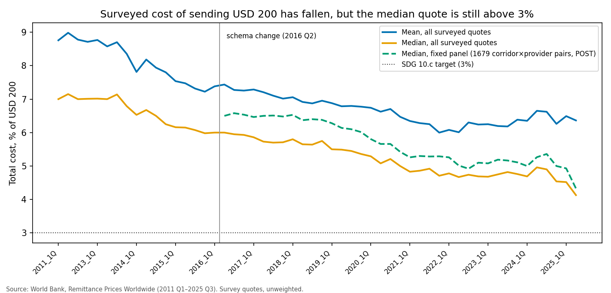
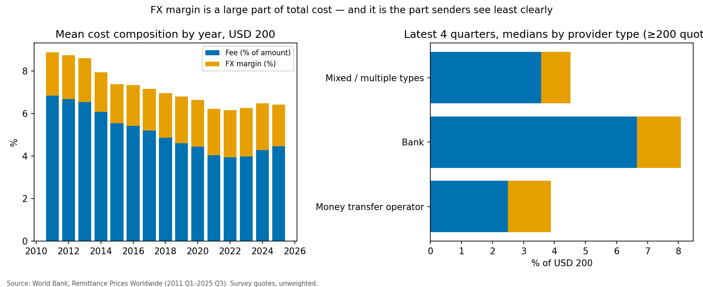
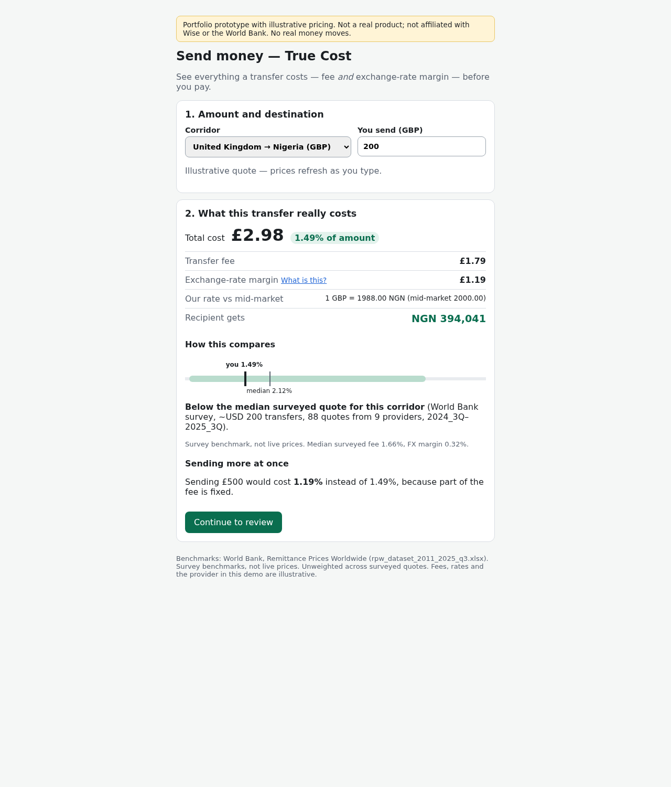

# Case Study — Making the true cost of small international transfers visible

*An independent Product Management portfolio project. It uses only publicly available data and is not affiliated with, endorsed by, or based on internal data from Wise or the World Bank.*

## 1. Context

Remittances are a lifeline for many households, and the UN SDG target 10.c aims to bring their cost below 3%. Remittance Prices Worldwide (RPW) is the World Bank's quarterly survey of what it costs to send USD 200 and USD 500 through named providers in hundreds of corridors. This project uses RPW to ask one question:

> **Where in the cost of a remittance is there a product problem worth solving?**

## 2. Data foundation (what makes the evidence trustworthy)

- **Source:** the original workbook (2011 Q1–2025 Q3, 253,960 survey records). It is committed unchanged and its SHA-256 is verified on every run (`docs/dataset_notes.md`).
- **Understanding and audit:**
  - Phase 3 documented every field (`docs/data_dictionary.md`, `docs/schema_comparison.md`, `docs/dataset_quality_report.md`).
  - Phase 3.5 was an adversarial audit that tried to falsify those documents. It checked 90 claims and found 2 incorrect, both about FX-rate units (`docs/phase3_audit_report.md`). The corrections were merged back into the documentation.
- **Pipeline** (`src/rpw`, `docs/pipeline.md`):
  - harmonises the two schemas (pre/post 2016 Q2) without discarding sheet-specific fields;
  - normalises provider names while keeping the raw values;
  - adds 27 data-quality flags (`data/processed/data_quality_flag_summary.csv`) and never deletes a row;
  - writes a wide output (one survey record per row) and a long output (one price quote per row);
  - is covered by automated tests.
- **Key analytical rules:**
  1. A quote whose FX margin is undisclosed is excluded from cost analysis, never treated as zero.
  2. FX-rate levels are not compared, because the payout currency is unrecorded. Only margin percentages are used.
  3. All statistics are unweighted survey statistics. The survey has no volumes.

## 3. What the data shows (`docs/eda_findings.md`)

| # | Finding (descriptive) | Evidence |
|---|---|---|
| F1 | Costs fell, but the typical quote is still above 3% | USD 200 median 6.00% (2016 Q2) → 4.13% (2025 Q3); fixed panel of 1,679 pairs 6.50% → 4.33% |
| F2 | Prices vary widely within a corridor | 87.6% of corridors have a surveyed quote ≤3%, but only 15.5% have a median ≤3%; median gap between typical quote and 10th percentile 2.22 pp |
| F3 | Fixed fees penalise small transfers | Median 4.50% at USD 200 vs 3.13% at USD 500; FX margin unchanged (2.03% vs 2.02%) |
| F4 | The FX margin is a large, less visible part of cost | ~31% of mean cost; exceeds the fee in 33.5% of quotes; zero-fee quotes still carry a 1.85% mean margin |
| F5–F6 | Banks and physical channels quote higher | Bank median 9.65% vs MTO 4.24%; digital-only cheaper within 81.0% of 326 corridors (not causal) |
| F7 | Transparency coding is unstable | The `transparent = no` flag disappears after 2021 while notes still describe non-transparent services |
| F9 | Some corridors lack low-cost options | 12 of 348 corridors have no surveyed quote ≤5%; 19 have no digital quote |

## 4. Opportunity choice (`docs/product_opportunity.md`)

Four hypotheses were compared:
- **H1:** all-in cost clarity;
- **H2:** small-transfer pricing;
- **H3:** entry into underserved corridors;
- **H4:** digital switching for cash senders.

**H1 was selected.** It has the broadest and strongest evidence (F2, F4, F7 hold across hundreds of corridors). It is also the most feasible MVP, because the fee and rate are already known at quote time, and it is a precondition for H2 and H4.

The dataset shows the *price structure*. That *senders misjudge cost and would act on clearer information* remains a **hypothesis** to validate.

## 5. Product proposal (`docs/prd.md`)

**"True Cost"** adds to the quote screen:
- one all-in cost number (fee plus FX margin against the mid-market rate);
- the breakdown;
- what the recipient gets;
- a World Bank survey benchmark for the corridor (10th percentile, median, 90th percentile);
- an amount-sensitivity hint.

The persona is a small-amount, frequent digital sender; it is a hypothesis, not research. Out of scope: naming competitors, "cheapest" claims, new pricing models.

## 6. Prototype (`prototype/`)

A responsive React app with:
- validation, loading, review, expired-quote and confirmation states;
- an FX explainer;
- an accessible benchmark range chart.

The benchmarks are **real RPW statistics** for 6 corridors (`prototype/src/data/benchmarks.json`, generated by `python -m rpw.prototype_data`). The fees and rates are **illustrative**, and the app is labelled as a non-production demo.

## 7. Measurement (`docs/measurement_plan.md`)

- **North Star:** informed completions ÷ quotes shown.
- **Experiment:** a user-level A/B test in 3–5 corridors.
- **Guardrails:** revenue per transfer, latency, abandonment, complaints.
- None of these can be measured from RPW. They need product telemetry and customer discovery, starting with 8–12 sender interviews and a comprehension test on the prototype.

## 8. Limitations and what I would do next

- **Survey sample:** the World Bank chooses corridors and providers; there are no volumes; averages are unweighted and differ from the World Bank's published Global Average.
- **Survey benchmarks are quarterly snapshots, not live prices.** In the prototype the benchmark bucket (≈USD 200 / ≈USD 500) is chosen from the entered amount without converting currency.
- **The digital/physical comparison is confounded,** and the channel field depends on a mapping assumption.
- **Data quality:** transparency coding changes around 2021, and some negative/extreme totals remain flagged rather than corrected.
- **Next steps:**
  - weight corridors with World Bank/KNOMAD bilateral remittance flow estimates;
  - run discovery interviews;
  - test the prototype for comprehension.
